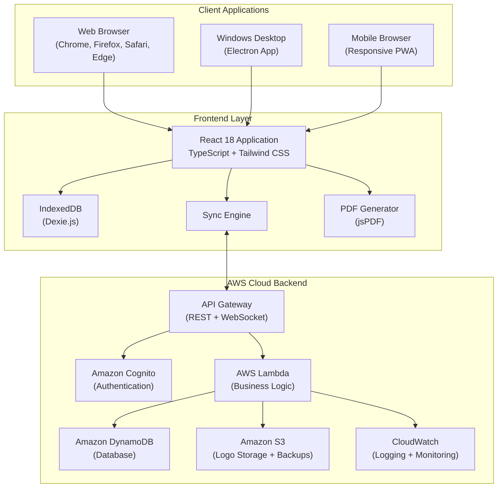
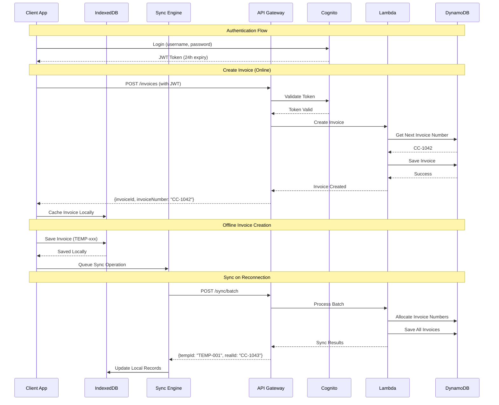
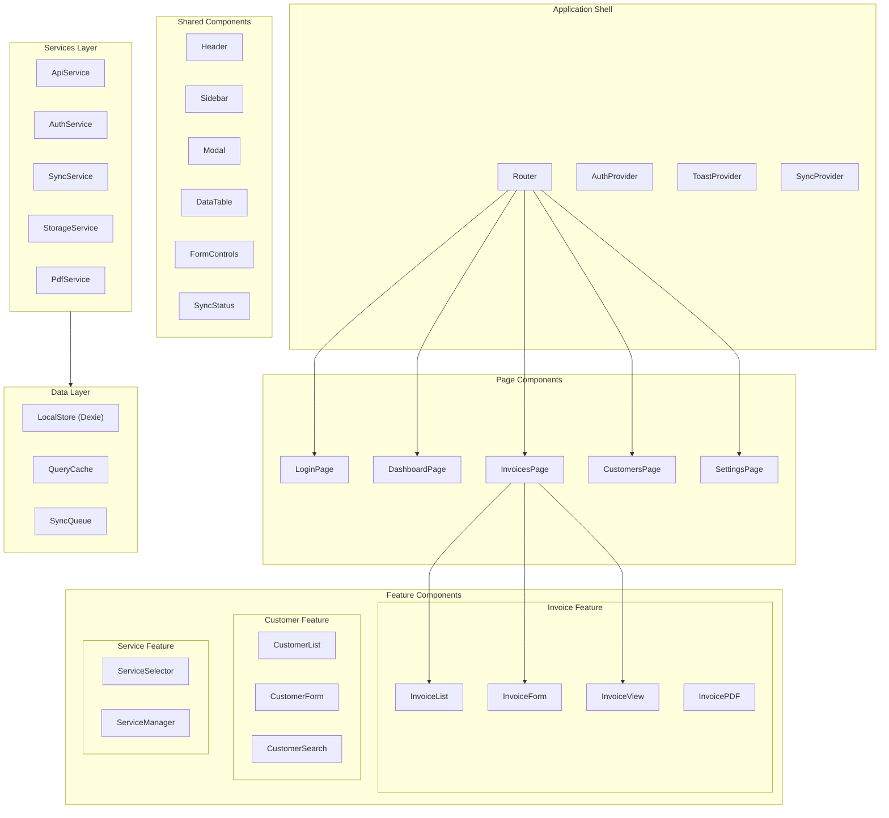
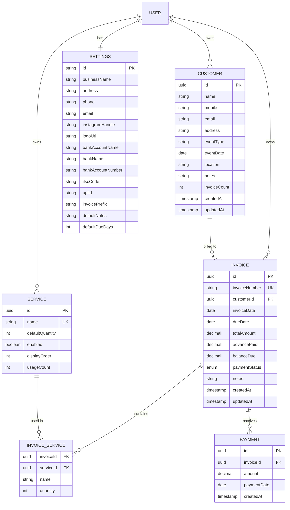
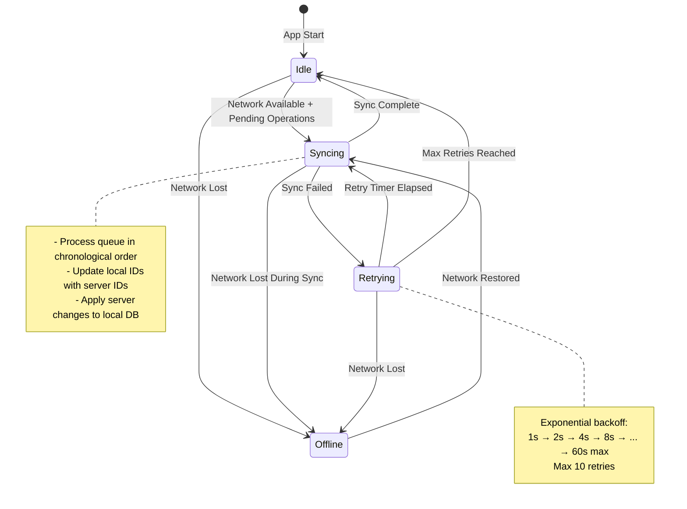
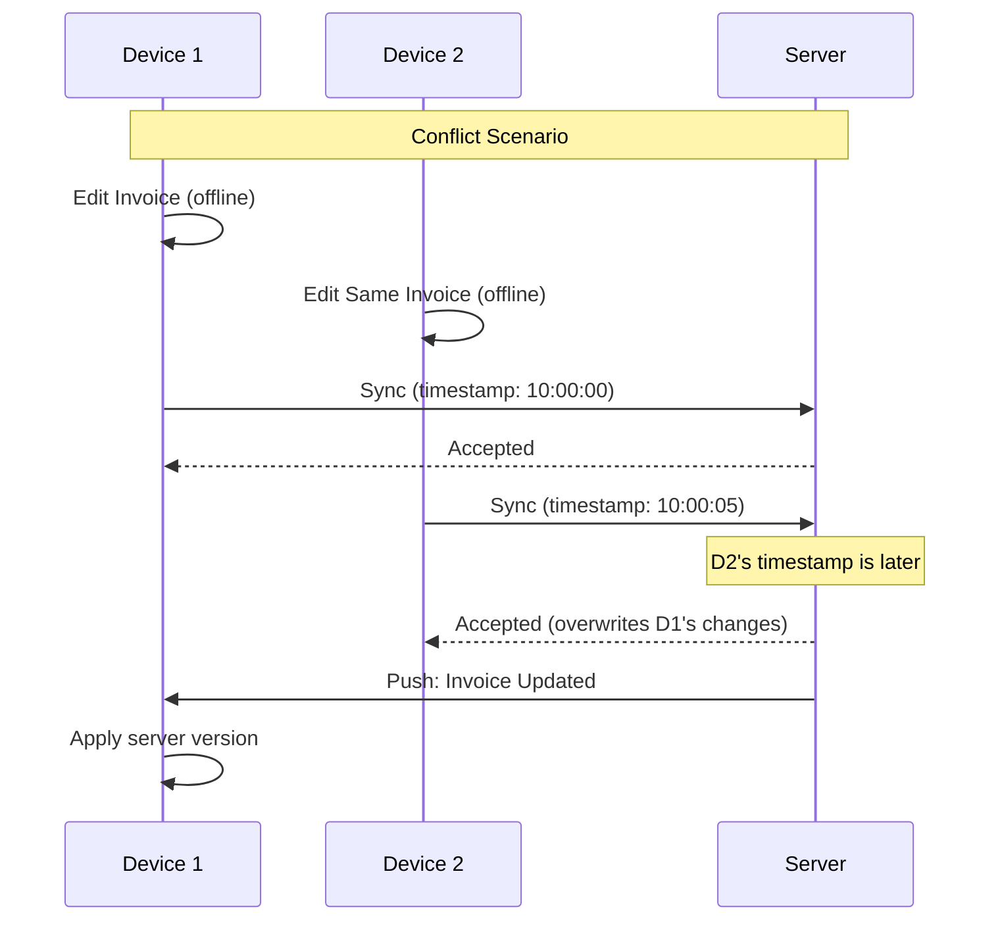
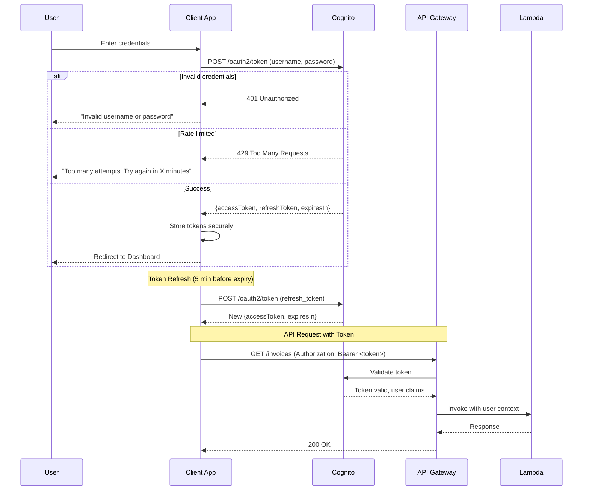
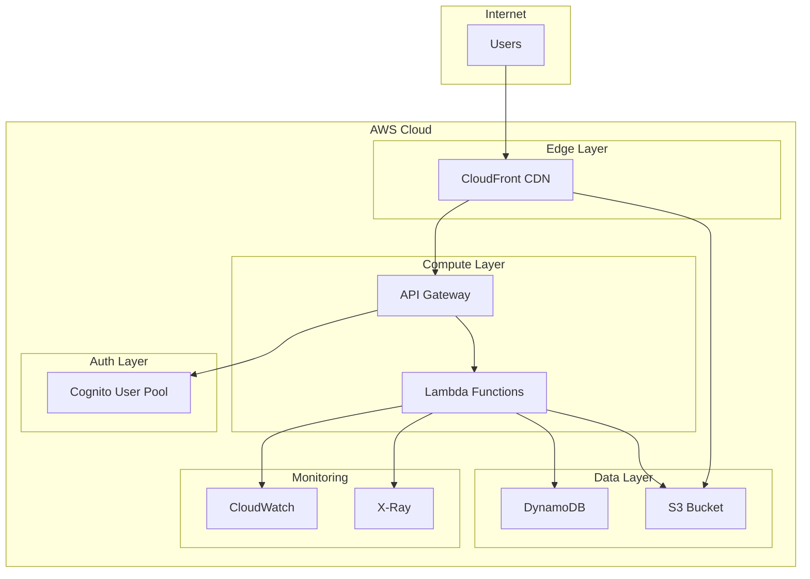

# Design Document: CandyCapture Photography Invoice Application

## Overview

The CandyCapture Photography Invoice Application is a multi-platform billing and invoice management system designed for professional photography studios. The application enables creating branded invoices with a distinctive pink/magenta design (#E91E63), managing customers, tracking payments, and synchronizing data across multiple devices through a central cloud backend.

### Key Design Goals

1. **Brand Consistency**: Pixel-perfect invoice rendering matching the reference design
2. **Multi-Device Sync**: Real-time synchronization across Windows desktops, web browsers, and mobile devices
3. **Offline-First**: Full functionality when offline with automatic sync on reconnection
4. **Scalability**: Support for 10,000+ customers, 50,000+ invoices, and 100 concurrent users
5. **Low-Cost Operations**: Serverless architecture to minimize operational costs
6. **Security**: JWT authentication, HTTPS, rate limiting, and secure password storage

### Technology Stack Summary

| Layer | Technology | Rationale |
|-------|------------|-----------|
| Frontend Framework | React 18 + TypeScript | Type safety, component reusability, existing team familiarity |
| Styling | Tailwind CSS | Rapid development, responsive design, consistent theming |
| Build Tool | Vite | Fast development builds, optimized production bundles |
| Desktop | Electron 27+ | Windows 10/11 support, native file dialogs, offline capability |
| PDF Generation | jsPDF + custom canvas rendering | Client-side generation, no server dependency |
| Backend | AWS Lambda + API Gateway | Serverless, pay-per-use, auto-scaling |
| Database | Amazon DynamoDB | Serverless, low latency, cost-effective at scale |
| Authentication | Amazon Cognito | Managed auth, JWT tokens, rate limiting built-in |
| Real-time Sync | WebSocket via API Gateway | Low-latency push notifications |
| Offline Storage | IndexedDB (Dexie.js) | Structured data, large capacity, async API |

---

## Architecture

### High-Level Architecture Diagram



### Client-Server Communication Flow



---

## Components and Interfaces

### Frontend Component Architecture



### Core TypeScript Interfaces

```typescript
// ============================================
// Domain Models
// ============================================

interface Customer {
  id: string;                    // UUID
  name: string;                  // Required, max 100 chars
  mobile: string;                // Required, exactly 10 digits
  email?: string;                // Optional, valid email format
  address?: string;              // Optional, max 500 chars
  eventType: string;             // Required, max 100 chars
  eventDate: string;             // ISO 8601 date
  location: string;              // Required, max 200 chars
  notes?: string;                // Optional, max 1000 chars
  invoiceCount: number;          // Computed field
  createdAt: string;             // ISO 8601 timestamp
  updatedAt: string;             // ISO 8601 timestamp
  syncStatus: SyncStatus;        // Local sync state
}

interface Invoice {
  id: string;                    // UUID (local) or server ID
  invoiceNumber: string;         // "CC-NNNN" or "TEMP-NNNN"
  customerId: string;            // Reference to Customer
  invoiceDate: string;           // ISO 8601 date
  dueDate: string;               // ISO 8601 date
  services: InvoiceService[];    // Array of selected services
  totalAmount: number;           // Package total (0.01 to 99,999,999.99)
  advancePaid: number;           // Sum of all payments
  balanceDue: number;            // Computed: totalAmount - advancePaid
  paymentStatus: PaymentStatus;  // PENDING | PARTIALLY_PAID | PAID
  payments: Payment[];           // Payment history
  notes?: string;                // Terms and conditions
  createdAt: string;
  updatedAt: string;
  syncStatus: SyncStatus;
}

interface InvoiceService {
  id: string;                    // Service ID reference
  name: string;                  // Service name (snapshot)
  quantity: number;              // 1-9999
}

interface Payment {
  id: string;
  amount: number;                // 0.01 to balance due
  paymentDate: string;           // ISO 8601 date
  createdAt: string;
}

interface Service {
  id: string;
  name: string;                  // 1-100 chars, unique
  defaultQuantity: number;       // 1-999
  enabled: boolean;
  displayOrder: number;
  usageCount: number;            // For deletion protection
  createdAt: string;
  updatedAt: string;
}

interface Settings {
  id: string;                    // Always "settings"
  businessName: string;          // Max 100 chars
  address: string;               // Max 500 chars
  phone: string;                 // 10-digit Indian mobile
  email: string;                 // Valid email, max 254 chars
  instagramHandle: string;       // Max 30 chars
  logoUrl?: string;              // S3 URL
  bankAccountName: string;       // Max 100 chars
  bankName: string;              // Max 100 chars
  bankAccountNumber: string;     // 9-18 digits
  ifscCode: string;              // 11 chars: AAAA0NNNNNN
  upiId: string;                 // Max 50 chars
  invoicePrefix: string;         // 1-10 alphanumeric/hyphens
  defaultNotes: string;          // Max 2000 chars
  defaultDueDays: number;        // 0-365
  updatedAt: string;
}

// ============================================
// Enums and Types
// ============================================

type PaymentStatus = 'PENDING' | 'PARTIALLY_PAID' | 'PAID';

type SyncStatus = 'synced' | 'pending' | 'error';

interface SyncOperation {
  id: string;
  type: 'CREATE' | 'UPDATE' | 'DELETE';
  entity: 'customer' | 'invoice' | 'service' | 'settings';
  entityId: string;
  payload: unknown;
  timestamp: string;
  retryCount: number;
  lastError?: string;
}

// ============================================
// API Contracts
// ============================================

interface ApiResponse<T> {
  success: boolean;
  data?: T;
  error?: {
    code: string;
    message: string;
  };
}

interface PaginatedResponse<T> {
  items: T[];
  nextToken?: string;
  totalCount: number;
}

interface SyncBatchRequest {
  operations: SyncOperation[];
  lastSyncTimestamp: string;
}

interface SyncBatchResponse {
  processed: Array<{
    operationId: string;
    success: boolean;
    error?: string;
    serverData?: unknown;
  }>;
  serverChanges: Array<{
    entity: string;
    entityId: string;
    operation: 'CREATE' | 'UPDATE' | 'DELETE';
    data: unknown;
    timestamp: string;
  }>;
  serverTimestamp: string;
}
```

### Service Layer Interfaces

```typescript
// ============================================
// AuthService
// ============================================

interface AuthService {
  login(username: string, password: string): Promise<AuthResult>;
  logout(): Promise<void>;
  refreshToken(): Promise<string>;
  getCurrentUser(): User | null;
  isAuthenticated(): boolean;
  onAuthStateChange(callback: (user: User | null) => void): () => void;
}

interface AuthResult {
  success: boolean;
  user?: User;
  error?: string;
}

// ============================================
// SyncService
// ============================================

interface SyncService {
  getStatus(): SyncConnectionStatus;
  queueOperation(operation: Omit<SyncOperation, 'id' | 'timestamp' | 'retryCount'>): Promise<void>;
  processPendingOperations(): Promise<SyncResult>;
  onStatusChange(callback: (status: SyncConnectionStatus) => void): () => void;
  forceSync(): Promise<SyncResult>;
}

type SyncConnectionStatus = 'online' | 'offline' | 'syncing' | 'error';

// ============================================
// StorageService (IndexedDB via Dexie)
// ============================================

interface StorageService {
  // Customers
  getCustomers(options?: QueryOptions): Promise<Customer[]>;
  getCustomerById(id: string): Promise<Customer | undefined>;
  searchCustomers(query: string): Promise<Customer[]>;
  saveCustomer(customer: Customer): Promise<void>;
  deleteCustomer(id: string): Promise<void>;
  
  // Invoices
  getInvoices(options?: InvoiceQueryOptions): Promise<Invoice[]>;
  getInvoiceById(id: string): Promise<Invoice | undefined>;
  saveInvoice(invoice: Invoice): Promise<void>;
  deleteInvoice(id: string): Promise<void>;
  
  // Services
  getServices(): Promise<Service[]>;
  saveService(service: Service): Promise<void>;
  deleteService(id: string): Promise<void>;
  
  // Settings
  getSettings(): Promise<Settings>;
  saveSettings(settings: Settings): Promise<void>;
  
  // Sync Queue
  getPendingOperations(): Promise<SyncOperation[]>;
  saveOperation(operation: SyncOperation): Promise<void>;
  removeOperation(id: string): Promise<void>;
  
  // Bulk operations
  clearAllData(): Promise<void>;
  importData(data: ExportData): Promise<void>;
  exportData(): Promise<ExportData>;
}

// ============================================
// PdfService
// ============================================

interface PdfService {
  generateInvoicePdf(invoice: Invoice, customer: Customer, settings: Settings): Promise<Blob>;
  previewInvoice(invoice: Invoice, customer: Customer, settings: Settings): Promise<string>; // Data URL
}
```

---

## Data Models

### DynamoDB Table Design

The backend uses a single-table design pattern for efficient queries and cost optimization.

```mermaid
erDiagram
    MAIN_TABLE {
        string PK "Partition Key"
        string SK "Sort Key"
        string GSI1PK "GSI1 Partition Key"
        string GSI1SK "GSI1 Sort Key"
        string entityType "Entity discriminator"
        map data "Entity-specific attributes"
        string updatedAt "ISO timestamp for sync"
    }
```

#### Primary Key Patterns

| Entity | PK | SK | GSI1PK | GSI1SK |
|--------|----|----|--------|--------|
| User | `USER#<userId>` | `PROFILE` | - | - |
| Customer | `USER#<userId>` | `CUSTOMER#<customerId>` | `USER#<userId>#CUSTOMER` | `<name>#<customerId>` |
| Invoice | `USER#<userId>` | `INVOICE#<invoiceId>` | `USER#<userId>#INVOICE` | `<invoiceDate>#<invoiceId>` |
| Service | `USER#<userId>` | `SERVICE#<serviceId>` | - | - |
| Settings | `USER#<userId>` | `SETTINGS` | - | - |
| InvoiceNumber | `USER#<userId>` | `INVOICE_COUNTER` | - | - |
| Payment | `USER#<userId>` | `PAYMENT#<invoiceId>#<paymentId>` | - | - |

#### Access Patterns

| Access Pattern | Key Condition | Index |
|----------------|---------------|-------|
| Get user settings | PK = `USER#<userId>`, SK = `SETTINGS` | Main |
| List all customers | PK = `USER#<userId>`, SK begins_with `CUSTOMER#` | Main |
| Search customers by name | GSI1PK = `USER#<userId>#CUSTOMER`, GSI1SK begins_with `<query>` | GSI1 |
| List invoices by date | GSI1PK = `USER#<userId>#INVOICE`, GSI1SK between dates | GSI1 |
| Get invoice with payments | PK = `USER#<userId>`, SK begins_with `INVOICE#<invoiceId>` OR `PAYMENT#<invoiceId>` | Main |
| Get next invoice number | PK = `USER#<userId>`, SK = `INVOICE_COUNTER` (atomic update) | Main |

### IndexedDB Schema (Dexie.js)

```typescript
import Dexie, { Table } from 'dexie';

class CandyCaptureDB extends Dexie {
  customers!: Table<Customer>;
  invoices!: Table<Invoice>;
  services!: Table<Service>;
  settings!: Table<Settings>;
  syncQueue!: Table<SyncOperation>;
  syncMeta!: Table<{ key: string; value: unknown }>;

  constructor() {
    super('CandyCaptureDB');
    
    this.version(1).stores({
      customers: 'id, name, mobile, eventDate, syncStatus, updatedAt',
      invoices: 'id, invoiceNumber, customerId, invoiceDate, paymentStatus, syncStatus, updatedAt',
      services: 'id, name, displayOrder, enabled',
      settings: 'id',
      syncQueue: 'id, entity, timestamp, retryCount',
      syncMeta: 'key'
    });
  }
}

export const db = new CandyCaptureDB();
```

### Entity Relationship Diagram



---

## API Design

### REST API Endpoints

Base URL: `https://api.candycapture.app/v1`

#### Authentication

| Method | Endpoint | Description |
|--------|----------|-------------|
| POST | `/auth/login` | Authenticate user |
| POST | `/auth/refresh` | Refresh JWT token |
| POST | `/auth/logout` | Invalidate session |
| POST | `/auth/change-password` | Change password |

#### Customers

| Method | Endpoint | Description |
|--------|----------|-------------|
| GET | `/customers` | List customers (paginated) |
| GET | `/customers/:id` | Get customer by ID |
| GET | `/customers/search?q=` | Search customers |
| POST | `/customers` | Create customer |
| PUT | `/customers/:id` | Update customer |
| DELETE | `/customers/:id` | Delete customer |

#### Invoices

| Method | Endpoint | Description |
|--------|----------|-------------|
| GET | `/invoices` | List invoices (paginated, filterable) |
| GET | `/invoices/:id` | Get invoice with payments |
| POST | `/invoices` | Create invoice (allocates number) |
| PUT | `/invoices/:id` | Update invoice |
| DELETE | `/invoices/:id` | Delete invoice |
| POST | `/invoices/:id/payments` | Add payment |
| DELETE | `/invoices/:id/payments/:paymentId` | Remove payment |
| GET | `/invoices/next-number` | Reserve next invoice number |

#### Services

| Method | Endpoint | Description |
|--------|----------|-------------|
| GET | `/services` | List all services |
| POST | `/services` | Create service |
| PUT | `/services/:id` | Update service |
| DELETE | `/services/:id` | Delete service |
| PUT | `/services/reorder` | Reorder services |

#### Settings

| Method | Endpoint | Description |
|--------|----------|-------------|
| GET | `/settings` | Get user settings |
| PUT | `/settings` | Update settings |
| POST | `/settings/logo` | Upload logo (multipart) |

#### Sync

| Method | Endpoint | Description |
|--------|----------|-------------|
| POST | `/sync/batch` | Process batch sync operations |
| GET | `/sync/changes?since=` | Get changes since timestamp |

#### Data Management

| Method | Endpoint | Description |
|--------|----------|-------------|
| GET | `/export` | Export all data as JSON |
| POST | `/import` | Import data from JSON |

### API Request/Response Examples

#### POST /auth/login

Request:
```json
{
  "username": "studio@candycapture.com",
  "password": "SecureP@ss123"
}
```

Response (200):
```json
{
  "success": true,
  "data": {
    "accessToken": "eyJhbGciOiJSUzI1NiIs...",
    "refreshToken": "eyJhbGciOiJSUzI1NiIs...",
    "expiresIn": 86400,
    "user": {
      "id": "usr_abc123",
      "username": "studio@candycapture.com"
    }
  }
}
```

#### POST /invoices

Request:
```json
{
  "customerId": "cust_xyz789",
  "invoiceDate": "2026-09-03",
  "dueDate": "2026-09-18",
  "services": [
    { "serviceId": "svc_001", "name": "Traditional Photo", "quantity": 1 },
    { "serviceId": "svc_002", "name": "Traditional Video", "quantity": 1 },
    { "serviceId": "svc_003", "name": "Candid Photo", "quantity": 2 }
  ],
  "totalAmount": 120000.00,
  "advancePaid": 20000.00,
  "notes": "50% advance required to confirm the booking."
}
```

Response (201):
```json
{
  "success": true,
  "data": {
    "id": "inv_def456",
    "invoiceNumber": "CC-1001",
    "customerId": "cust_xyz789",
    "invoiceDate": "2026-09-03",
    "dueDate": "2026-09-18",
    "services": [...],
    "totalAmount": 120000.00,
    "advancePaid": 20000.00,
    "balanceDue": 100000.00,
    "paymentStatus": "PARTIALLY_PAID",
    "payments": [
      {
        "id": "pay_001",
        "amount": 20000.00,
        "paymentDate": "2026-09-03",
        "createdAt": "2026-09-03T10:30:00Z"
      }
    ],
    "createdAt": "2026-09-03T10:30:00Z",
    "updatedAt": "2026-09-03T10:30:00Z"
  }
}
```

#### POST /sync/batch

Request:
```json
{
  "operations": [
    {
      "id": "op_001",
      "type": "CREATE",
      "entity": "invoice",
      "entityId": "local_temp_001",
      "payload": { ... },
      "timestamp": "2026-09-03T10:30:00Z",
      "retryCount": 0
    }
  ],
  "lastSyncTimestamp": "2026-09-03T09:00:00Z"
}
```

Response (200):
```json
{
  "success": true,
  "data": {
    "processed": [
      {
        "operationId": "op_001",
        "success": true,
        "serverData": {
          "id": "inv_def456",
          "invoiceNumber": "CC-1002"
        }
      }
    ],
    "serverChanges": [
      {
        "entity": "customer",
        "entityId": "cust_new123",
        "operation": "CREATE",
        "data": { ... },
        "timestamp": "2026-09-03T09:30:00Z"
      }
    ],
    "serverTimestamp": "2026-09-03T10:31:00Z"
  }
}
```

### WebSocket Events (Real-time Sync)

Connection URL: `wss://ws.candycapture.app?token=<jwt>`

#### Server → Client Events

```typescript
// Data changed on another device
interface DataChangedEvent {
  type: 'DATA_CHANGED';
  payload: {
    entity: 'customer' | 'invoice' | 'service' | 'settings';
    entityId: string;
    operation: 'CREATE' | 'UPDATE' | 'DELETE';
    timestamp: string;
  };
}

// Force client to refresh data
interface RefreshRequiredEvent {
  type: 'REFRESH_REQUIRED';
  payload: {
    reason: 'settings_changed' | 'bulk_import' | 'admin_action';
  };
}
```

---

## Synchronization Data Flow

### Sync Engine State Machine



### Conflict Resolution Strategy

The system uses **Last-Write-Wins (LWW)** with server timestamps:



### Offline Queue Processing

```typescript
// Sync Queue Processing Algorithm
async function processSyncQueue(): Promise<void> {
  const operations = await db.syncQueue
    .orderBy('timestamp')
    .toArray();
  
  if (operations.length === 0) return;
  
  // Batch operations (max 25 per batch for DynamoDB)
  const batches = chunk(operations, 25);
  
  for (const batch of batches) {
    try {
      const response = await api.post('/sync/batch', {
        operations: batch,
        lastSyncTimestamp: await getLastSyncTimestamp()
      });
      
      // Process successful operations
      for (const result of response.processed) {
        if (result.success) {
          // Update local entity with server data
          await updateLocalEntity(result);
          // Remove from queue
          await db.syncQueue.delete(result.operationId);
        } else {
          // Increment retry count or mark as failed
          await handleSyncFailure(result);
        }
      }
      
      // Apply server changes
      for (const change of response.serverChanges) {
        await applyServerChange(change);
      }
      
      await setLastSyncTimestamp(response.serverTimestamp);
      
    } catch (error) {
      if (isNetworkError(error)) {
        // Go offline, will retry later
        throw error;
      }
      // Handle other errors
    }
  }
}
```

---

## PDF Generation Approach

### Invoice Layout Specification

Based on the reference image, the invoice follows this precise layout:

```
┌─────────────────────────────────────────────────────────────┐
│ A4 Portrait: 210mm × 297mm                                  │
│ Margins: 15mm all sides                                     │
│ Printable Area: 180mm × 267mm                               │
├─────────────────────────────────────────────────────────────┤
│                                                             │
│  [LOGO]                                    INVOICE          │
│  CandyCapture Photography                  ┌─────────────┐  │
│  P H O T O G R A P H Y                     │ Invoice No  │  │
│  We Capture Your Sweetest Moments ♥        │ Invoice Date│  │
│                                            │ Due Date    │  │
│                                            └─────────────┘  │
├─────────────────────────────────────────────────────────────┤
│  👤 BILL TO                        📍 FROM                  │
│  Name    : Bala                    CandyCapture Photography │
│  Mobile  : 9500440272              No. 12, Parasakthi...    │
│  Event   : Wedding                 📞 95004 40272           │
│  Event Date: 20-Nov-2026           ✉ candycapture...@gmail  │
│  Location: Sivakasi Paper...       📷 @candycapture...      │
├─────────────────────────────────────────────────────────────┤
│  📋 SERVICES BOOKED                                         │
│  ┌─────┬────────────────────────────────────────┬─────┐     │
│  │S.NO │ SERVICE                                │ QTY │     │
│  ├─────┼────────────────────────────────────────┼─────┤     │
│  │  1  │ Traditional Photo                      │  1  │     │
│  │  2  │ Traditional Video                      │  1  │     │
│  │ ... │ ...                                    │ ... │     │
│  └─────┴────────────────────────────────────────┴─────┘     │
├─────────────────────────────────────────────────────────────┤
│  📝 NOTES                          TOTAL AMOUNT  ₹1,20,000  │
│  • 50% advance required...         ADVANCE PAID    ₹20,000  │
│  • Balance to be paid...           ╔═══════════════════════╗│
│  • Raw files will be...            ║ BALANCE DUE ₹1,00,000 ║│
│  • Travelling & accommodation...   ╚═══════════════════════╝│
│                                                             │
│  Thank You! ♥                      PAYMENT STATUS: [PENDING]│
│  for choosing CandyCapture                                  │
├─────────────────────────────────────────────────────────────┤
│  🏦 PAYMENT DETAILS                     [Signature Area]    │
│  Account Name : CandyCapture...         CandyCapture        │
│  Bank Name    : ICICI Bank              Authorized Signature│
│  Account No   : 1234 5678 9012                              │
│  IFSC Code    : ICIC0001234                                 │
│  UPI ID       : candycapture@upi                            │
├─────────────────────────────────────────────────────────────┤
│  📞 95004 40272 │ ✉ candycapture...@gmail │ 📷 @candycapture│
└─────────────────────────────────────────────────────────────┘
```

### PDF Generation Implementation

```typescript
import jsPDF from 'jspdf';

interface PdfGeneratorConfig {
  pageWidth: number;      // 210mm
  pageHeight: number;     // 297mm
  margin: number;         // 15mm
  primaryColor: string;   // #E91E63
  textColor: string;      // #2D1A26
}

class InvoicePdfGenerator {
  private doc: jsPDF;
  private config: PdfGeneratorConfig;
  private y: number = 0;  // Current Y position
  
  constructor(config: PdfGeneratorConfig) {
    this.config = config;
    this.doc = new jsPDF({
      orientation: 'portrait',
      unit: 'mm',
      format: 'a4'
    });
  }
  
  async generate(
    invoice: Invoice, 
    customer: Customer, 
    settings: Settings
  ): Promise<Blob> {
    this.y = this.config.margin;
    
    // 1. Header Section (Logo + Invoice Title)
    await this.renderHeader(settings, invoice);
    
    // 2. Bill To / From Section
    this.renderBillToFrom(customer, settings);
    
    // 3. Services Table
    this.renderServicesTable(invoice.services);
    
    // 4. Notes + Payment Summary
    this.renderNotesAndSummary(invoice, settings);
    
    // 5. Payment Details + Signature
    this.renderPaymentDetails(settings);
    
    // 6. Footer
    this.renderFooter(settings);
    
    return this.doc.output('blob');
  }
  
  private async renderHeader(settings: Settings, invoice: Invoice): Promise<void> {
    const { margin, primaryColor } = this.config;
    const contentWidth = this.config.pageWidth - (margin * 2);
    
    // Logo (left side)
    if (settings.logoUrl) {
      try {
        const logoData = await this.loadImage(settings.logoUrl);
        this.doc.addImage(logoData, 'PNG', margin, this.y, 50, 35);
      } catch {
        // Fallback: text placeholder
        this.doc.setFontSize(18);
        this.doc.setTextColor(primaryColor);
        this.doc.text('CandyCapture Photography', margin, this.y + 15);
      }
    }
    
    // INVOICE title (right side)
    this.doc.setFontSize(28);
    this.doc.setTextColor(primaryColor);
    this.doc.text('INVOICE', margin + contentWidth, this.y + 10, { align: 'right' });
    
    // Invoice metadata box
    const boxX = margin + contentWidth - 65;
    const boxY = this.y + 18;
    this.doc.setDrawColor(primaryColor);
    this.doc.setLineWidth(0.5);
    this.doc.rect(boxX, boxY, 65, 25);
    
    this.doc.setFontSize(10);
    this.doc.setTextColor('#666666');
    const metaLabels = ['Invoice No', 'Invoice Date', 'Due Date'];
    const metaValues = [
      invoice.invoiceNumber,
      this.formatDate(invoice.invoiceDate),
      this.formatDate(invoice.dueDate)
    ];
    
    metaLabels.forEach((label, i) => {
      const rowY = boxY + 6 + (i * 7);
      this.doc.text(label, boxX + 3, rowY);
      this.doc.text(':', boxX + 28, rowY);
      this.doc.setTextColor('#000000');
      this.doc.text(metaValues[i], boxX + 32, rowY);
      this.doc.setTextColor('#666666');
    });
    
    this.y += 50;
  }
  
  private renderServicesTable(services: InvoiceService[]): void {
    const { margin, primaryColor } = this.config;
    const contentWidth = this.config.pageWidth - (margin * 2);
    
    // Section header
    this.doc.setFillColor(primaryColor);
    this.doc.setTextColor('#FFFFFF');
    this.doc.setFontSize(11);
    
    // Table header
    const colWidths = [15, contentWidth - 35, 20]; // S.NO, SERVICE, QTY
    let x = margin;
    
    this.doc.rect(margin, this.y, contentWidth, 8, 'F');
    this.doc.text('S.NO', x + 3, this.y + 5.5);
    x += colWidths[0];
    this.doc.text('SERVICE', x + 3, this.y + 5.5);
    x += colWidths[1];
    this.doc.text('QTY', x + 3, this.y + 5.5);
    
    this.y += 8;
    
    // Table rows
    this.doc.setTextColor('#333333');
    this.doc.setFontSize(10);
    
    services.forEach((service, index) => {
      const rowY = this.y + 6;
      x = margin;
      
      // Alternating row background
      if (index % 2 === 1) {
        this.doc.setFillColor('#FDF0F6');
        this.doc.rect(margin, this.y, contentWidth, 8, 'F');
      }
      
      // S.NO (centered)
      this.doc.text(String(index + 1), x + 7.5, rowY, { align: 'center' });
      x += colWidths[0];
      
      // SERVICE
      this.doc.text(service.name, x + 3, rowY);
      x += colWidths[1];
      
      // QTY (centered)
      this.doc.text(String(service.quantity), x + 10, rowY, { align: 'center' });
      
      this.y += 8;
    });
    
    // Table border
    this.doc.setDrawColor('#E8D0DB');
    this.doc.rect(margin, this.y - (services.length * 8) - 8, contentWidth, (services.length + 1) * 8);
    
    this.y += 5;
  }
  
  private formatIndianCurrency(amount: number): string {
    // Format as ₹X,XX,XXX.XX (Indian numbering)
    const formatted = amount.toLocaleString('en-IN', {
      minimumFractionDigits: 2,
      maximumFractionDigits: 2
    });
    return `₹${formatted}`;
  }
  
  private formatDate(isoDate: string): string {
    const date = new Date(isoDate);
    return date.toLocaleDateString('en-IN', {
      day: '2-digit',
      month: 'short',
      year: 'numeric'
    });
  }
  
  // ... additional rendering methods
}
```

### Payment Status Badge Colors

| Status | Background | Text Color |
|--------|------------|------------|
| PENDING | #FF9800 (Orange) | #FFFFFF |
| PARTIALLY_PAID | #FFC107 (Yellow) | #000000 |
| PAID | #4CAF50 (Green) | #FFFFFF |

---

## Error Handling

### Error Categories and Handling Strategy

| Category | Examples | Client Handling | User Message |
|----------|----------|-----------------|--------------|
| **Network** | Timeout, DNS failure, no connectivity | Switch to offline mode, queue operations | "You're offline. Changes will sync when connected." |
| **Authentication** | Token expired, invalid credentials | Redirect to login, clear local tokens | "Session expired. Please log in again." |
| **Validation** | Invalid input, missing required fields | Highlight field, prevent submission | Specific field error message |
| **Conflict** | Record modified elsewhere | Apply server version, notify user | "This record was updated elsewhere. Showing latest version." |
| **Rate Limit** | Too many requests | Exponential backoff, retry later | "Too many requests. Please wait a moment." |
| **Server Error** | 500, Lambda timeout | Retry with backoff, log error | "Something went wrong. Please try again." |
| **Not Found** | Deleted record | Remove local copy, notify user | "This record no longer exists." |

### Error Boundary Implementation

```typescript
interface ErrorBoundaryState {
  hasError: boolean;
  error: Error | null;
  errorInfo: React.ErrorInfo | null;
}

class ErrorBoundary extends React.Component<Props, ErrorBoundaryState> {
  state: ErrorBoundaryState = {
    hasError: false,
    error: null,
    errorInfo: null
  };

  static getDerivedStateFromError(error: Error): Partial<ErrorBoundaryState> {
    return { hasError: true, error };
  }

  componentDidCatch(error: Error, errorInfo: React.ErrorInfo): void {
    // Log to backend
    errorReportingService.captureError({
      error: {
        name: error.name,
        message: error.message,
        stack: error.stack
      },
      componentStack: errorInfo.componentStack,
      timestamp: new Date().toISOString(),
      userAgent: navigator.userAgent,
      url: window.location.href
    });
  }

  render(): React.ReactNode {
    if (this.state.hasError) {
      return (
        <ErrorFallback
          onReload={() => window.location.reload()}
          onGoHome={() => {
            this.setState({ hasError: false, error: null });
            window.location.href = '/';
          }}
        />
      );
    }
    return this.props.children;
  }
}
```

### Retry Strategy with Exponential Backoff

```typescript
interface RetryConfig {
  maxRetries: number;      // 10
  baseDelay: number;       // 1000ms
  maxDelay: number;        // 60000ms
  backoffFactor: number;   // 2
}

async function withRetry<T>(
  operation: () => Promise<T>,
  config: RetryConfig = {
    maxRetries: 10,
    baseDelay: 1000,
    maxDelay: 60000,
    backoffFactor: 2
  }
): Promise<T> {
  let lastError: Error;
  
  for (let attempt = 0; attempt < config.maxRetries; attempt++) {
    try {
      return await operation();
    } catch (error) {
      lastError = error as Error;
      
      // Don't retry non-retryable errors
      if (!isRetryableError(error)) {
        throw error;
      }
      
      // Calculate delay with jitter
      const delay = Math.min(
        config.baseDelay * Math.pow(config.backoffFactor, attempt),
        config.maxDelay
      );
      const jitter = delay * 0.1 * Math.random();
      
      await sleep(delay + jitter);
    }
  }
  
  throw lastError!;
}

function isRetryableError(error: unknown): boolean {
  if (error instanceof NetworkError) return true;
  if (error instanceof ApiError) {
    return error.status >= 500 || error.status === 429;
  }
  return false;
}
```

---

## Security Architecture

### Authentication Flow



### Security Controls

| Control | Implementation | Requirement Reference |
|---------|----------------|----------------------|
| Password hashing | bcrypt, 12 rounds | Req 15.3 |
| Password policy | Min 8 chars, 1 upper, 1 lower, 1 number | Req 15.4 |
| Token storage | Memory only (not localStorage) | Req 15.5 |
| Session management | JWT, 24h expiry, auto-refresh | Req 15.6, 15.7 |
| Rate limiting | 5 failed attempts / 15 min / IP | Req 15.10 |
| Transport security | HTTPS only | Req 3.8 |
| Audit logging | All auth attempts, 90-day retention | Req 15.12 |
| Input validation | Server-side validation on all inputs | Various |
| CORS | Whitelist allowed origins | Best practice |

### Secure Token Management

```typescript
// Token stored in memory only, not localStorage
class SecureTokenStore {
  private accessToken: string | null = null;
  private refreshToken: string | null = null;
  private expiresAt: number = 0;
  
  setTokens(tokens: TokenResponse): void {
    this.accessToken = tokens.accessToken;
    this.refreshToken = tokens.refreshToken;
    this.expiresAt = Date.now() + (tokens.expiresIn * 1000);
    
    // Schedule refresh 5 minutes before expiry
    this.scheduleRefresh(tokens.expiresIn - 300);
  }
  
  getAccessToken(): string | null {
    if (this.expiresAt < Date.now()) {
      return null; // Token expired
    }
    return this.accessToken;
  }
  
  clear(): void {
    this.accessToken = null;
    this.refreshToken = null;
    this.expiresAt = 0;
  }
  
  private scheduleRefresh(delaySeconds: number): void {
    setTimeout(async () => {
      if (this.refreshToken) {
        try {
          const tokens = await authApi.refreshToken(this.refreshToken);
          this.setTokens(tokens);
        } catch {
          // Refresh failed, force re-login
          this.clear();
          window.location.href = '/login?reason=session_expired';
        }
      }
    }, delaySeconds * 1000);
  }
}
```

---

## Testing Strategy

### Testing Pyramid

```
              ╱╲
             ╱  ╲
            ╱ E2E╲         ~5% - Critical user journeys
           ╱──────╲
          ╱        ╲
         ╱Integration╲     ~20% - API, DB, service interactions
        ╱──────────────╲
       ╱                ╲
      ╱    Unit Tests    ╲  ~75% - Components, utilities, pure functions
     ╱────────────────────╲
```

### Unit Testing

**Framework**: Jest + React Testing Library

**Coverage Targets**:
- Components: 80%
- Services: 90%
- Utilities: 95%
- Overall: 80%

**Key Test Areas**:

1. **Invoice Form Validation**
   - Valid input acceptance
   - Invalid input rejection
   - Edge cases (max values, special characters)

2. **Payment Calculations**
   - Balance calculation accuracy
   - Status determination logic
   - Indian currency formatting

3. **PDF Generation**
   - Layout correctness
   - Data population
   - Logo handling

4. **Sync Engine**
   - Queue management
   - Conflict resolution
   - Offline detection

### Integration Testing

**Framework**: Jest + Supertest (API), Playwright (E2E)

**Key Integration Tests**:

1. **Authentication Flow**
   - Login with valid/invalid credentials
   - Token refresh
   - Rate limiting behavior

2. **Invoice CRUD Operations**
   - Create invoice with valid data
   - Update payment status
   - Delete invoice

3. **Sync Scenarios**
   - Offline queue processing
   - Conflict resolution
   - Multi-device sync

### Example Test Cases

```typescript
// Unit Test: Payment Status Calculation
describe('PaymentTracker', () => {
  describe('calculatePaymentStatus', () => {
    it('returns PENDING when advancePaid is 0', () => {
      expect(calculatePaymentStatus(10000, 0)).toBe('PENDING');
    });
    
    it('returns PARTIALLY_PAID when advancePaid is between 0 and totalAmount', () => {
      expect(calculatePaymentStatus(10000, 5000)).toBe('PARTIALLY_PAID');
    });
    
    it('returns PAID when advancePaid equals totalAmount', () => {
      expect(calculatePaymentStatus(10000, 10000)).toBe('PAID');
    });
    
    it('returns PAID when advancePaid exceeds totalAmount', () => {
      expect(calculatePaymentStatus(10000, 15000)).toBe('PAID');
    });
  });
});

// Unit Test: Indian Currency Formatting
describe('formatIndianCurrency', () => {
  it('formats amounts with Indian numbering system', () => {
    expect(formatIndianCurrency(120000)).toBe('₹1,20,000.00');
    expect(formatIndianCurrency(1000000)).toBe('₹10,00,000.00');
    expect(formatIndianCurrency(100)).toBe('₹100.00');
  });
});

// Integration Test: Invoice Creation
describe('POST /invoices', () => {
  it('creates invoice and allocates sequential number', async () => {
    const response = await request(app)
      .post('/v1/invoices')
      .set('Authorization', `Bearer ${validToken}`)
      .send({
        customerId: 'cust_123',
        invoiceDate: '2026-09-03',
        dueDate: '2026-09-18',
        services: [{ serviceId: 'svc_001', name: 'Photo', quantity: 1 }],
        totalAmount: 50000,
        advancePaid: 0
      });
    
    expect(response.status).toBe(201);
    expect(response.body.data.invoiceNumber).toMatch(/^CC-\d{4}$/);
    expect(response.body.data.paymentStatus).toBe('PENDING');
  });
});
```

---

## Deployment Architecture

### AWS Infrastructure



### Cost Estimation (Monthly)

For ~100 active users, ~1000 invoices/month:

| Service | Usage | Estimated Cost |
|---------|-------|----------------|
| DynamoDB | 10 GB storage, 1M requests | ~$5 |
| Lambda | 500K invocations, 128MB | ~$2 |
| API Gateway | 500K requests | ~$2 |
| S3 | 5 GB storage, 10K requests | ~$1 |
| CloudFront | 50 GB transfer | ~$5 |
| Cognito | 100 MAU | Free tier |
| CloudWatch | Basic logging | ~$3 |
| **Total** | | **~$18/month** |

### Infrastructure as Code (Terraform)

```hcl
# main.tf (excerpt)

resource "aws_dynamodb_table" "main" {
  name           = "candycapture-${var.environment}"
  billing_mode   = "PAY_PER_REQUEST"
  hash_key       = "PK"
  range_key      = "SK"

  attribute {
    name = "PK"
    type = "S"
  }

  attribute {
    name = "SK"
    type = "S"
  }

  attribute {
    name = "GSI1PK"
    type = "S"
  }

  attribute {
    name = "GSI1SK"
    type = "S"
  }

  global_secondary_index {
    name            = "GSI1"
    hash_key        = "GSI1PK"
    range_key       = "GSI1SK"
    projection_type = "ALL"
  }

  point_in_time_recovery {
    enabled = true
  }

  tags = {
    Environment = var.environment
    Application = "candycapture"
  }
}

resource "aws_cognito_user_pool" "main" {
  name = "candycapture-${var.environment}"

  password_policy {
    minimum_length    = 8
    require_lowercase = true
    require_uppercase = true
    require_numbers   = true
  }

  account_recovery_setting {
    recovery_mechanism {
      name     = "verified_email"
      priority = 1
    }
  }
}
```

---

## Correctness Properties

*A property is a characteristic or behavior that should hold true across all valid executions of a system—essentially, a formal statement about what the system should do. Properties serve as the bridge between human-readable specifications and machine-verifiable correctness guarantees.*

### Property 1: Payment Balance Calculation Accuracy

*For any* invoice with a total amount T and advance paid A where A ≤ T, the balance due SHALL equal T - A exactly, with no floating-point precision errors when displayed.

**Validates: Requirements 1.14, 7.1**

### Property 2: Payment Status Determination

*For any* invoice, the payment status SHALL be:
- PENDING when advancePaid = 0
- PARTIALLY_PAID when 0 < advancePaid < totalAmount
- PAID when advancePaid ≥ totalAmount

**Validates: Requirements 7.2, 7.3, 7.4**

### Property 3: Invoice Number Uniqueness

*For any* two invoices created in the system (across all devices), their invoice numbers SHALL be distinct, and the sequence SHALL be monotonically increasing within the same prefix.

**Validates: Requirements 4.1, 4.3, 4.8**

### Property 4: Invoice Number Format Compliance

*For any* invoice number generated by the system, it SHALL match the pattern `{prefix}NNNN` where prefix is 1-10 alphanumeric characters or hyphens, and NNNN is a 4-digit number between 1001 and 9999.

**Validates: Requirements 4.1, 4.9**

### Property 5: Offline-Online Invoice Number Transition

*For any* invoice created offline with a temporary ID, when synchronized, the temporary ID SHALL be replaced with a valid permanent invoice number, and the invoice SHALL be retrievable by both IDs during the transition.

**Validates: Requirements 4.6, 4.7**

### Property 6: Customer Deletion Protection

*For any* customer with at least one associated invoice, deletion attempts SHALL be rejected and the customer record SHALL remain unchanged.

**Validates: Requirements 5.7**

### Property 7: Service Usage Tracking

*For any* service that has been used in at least one invoice, deletion attempts SHALL be rejected and the service record SHALL remain unchanged.

**Validates: Requirements 6.8, 6.9**

### Property 8: Mobile Number Validation

*For any* mobile number input, acceptance SHALL occur if and only if the input consists of exactly 10 digits.

**Validates: Requirements 5.2**

### Property 9: Advance Payment Upper Bound

*For any* advance payment amount input, acceptance SHALL occur only if the amount is less than or equal to the remaining balance due.

**Validates: Requirements 7.7, 7.8**

### Property 10: Currency Formatting Consistency

*For any* monetary amount, the formatted string SHALL use the Indian numbering system with comma separators at appropriate positions and exactly 2 decimal places, prefixed with the ₹ symbol.

**Validates: Requirements 7.5**

### Property 11: Sync Queue Ordering

*For any* set of offline operations queued for synchronization, they SHALL be processed in chronological order based on their creation timestamps.

**Validates: Requirements 3.6**

### Property 12: Data Export Completeness

*For any* data export operation, the exported JSON SHALL contain all customers, invoices, payment records, services, and settings, and SHALL NOT contain authentication tokens or passwords.

**Validates: Requirements 16.3, 16.10**

### Property 13: Import-Export Round Trip

*For any* complete data set exported from the system, importing it back (with Replace strategy) SHALL result in a database state equivalent to the original, excluding server-generated timestamps.

**Validates: Requirements 16.3, 16.4, 16.5**

### Property 14: Services Table Column Constraint

*For any* generated invoice PDF, the services table SHALL contain exactly three columns (S.NO, SERVICE, QTY) and SHALL NOT contain any price, rate, or amount columns.

**Validates: Requirements 2.1, 2.4, 1.9, 1.10**

### Property 15: Auto-Save Draft Recovery

*For any* invoice form with unsaved changes, if the application crashes and restarts within 24 hours, the draft data SHALL be recoverable from local storage.

**Validates: Requirements 17.3, 17.4**

---

## File Structure

```
candycapture-invoice-app/
├── .kiro/
│   └── specs/
│       └── candycapture-invoice-app/
│           ├── .config.kiro
│           ├── requirements.md
│           ├── design.md
│           └── tasks.md
├── packages/
│   ├── web/                          # React web application
│   │   ├── src/
│   │   │   ├── components/
│   │   │   │   ├── common/           # Shared UI components
│   │   │   │   │   ├── Button/
│   │   │   │   │   ├── Input/
│   │   │   │   │   ├── Modal/
│   │   │   │   │   ├── Table/
│   │   │   │   │   └── Toast/
│   │   │   │   ├── layout/           # Layout components
│   │   │   │   │   ├── Header.tsx
│   │   │   │   │   ├── Sidebar.tsx
│   │   │   │   │   └── MainLayout.tsx
│   │   │   │   ├── invoice/          # Invoice feature
│   │   │   │   │   ├── InvoiceForm.tsx
│   │   │   │   │   ├── InvoiceList.tsx
│   │   │   │   │   ├── InvoiceView.tsx
│   │   │   │   │   ├── InvoicePdf.tsx
│   │   │   │   │   └── ServiceSelector.tsx
│   │   │   │   ├── customer/         # Customer feature
│   │   │   │   │   ├── CustomerForm.tsx
│   │   │   │   │   ├── CustomerList.tsx
│   │   │   │   │   └── CustomerSearch.tsx
│   │   │   │   └── settings/         # Settings feature
│   │   │   │       ├── BusinessSettings.tsx
│   │   │   │       ├── BankSettings.tsx
│   │   │   │       └── ServiceManager.tsx
│   │   │   ├── pages/
│   │   │   │   ├── LoginPage.tsx
│   │   │   │   ├── DashboardPage.tsx
│   │   │   │   ├── InvoicesPage.tsx
│   │   │   │   ├── CustomersPage.tsx
│   │   │   │   └── SettingsPage.tsx
│   │   │   ├── services/
│   │   │   │   ├── api.ts            # HTTP client
│   │   │   │   ├── auth.ts           # Authentication
│   │   │   │   ├── sync.ts           # Sync engine
│   │   │   │   ├── storage.ts        # IndexedDB (Dexie)
│   │   │   │   └── pdf.ts            # PDF generation
│   │   │   ├── hooks/
│   │   │   │   ├── useAuth.ts
│   │   │   │   ├── useSync.ts
│   │   │   │   ├── useInvoices.ts
│   │   │   │   └── useCustomers.ts
│   │   │   ├── context/
│   │   │   │   ├── AuthContext.tsx
│   │   │   │   ├── SyncContext.tsx
│   │   │   │   └── ToastContext.tsx
│   │   │   ├── types/
│   │   │   │   ├── models.ts
│   │   │   │   └── api.ts
│   │   │   ├── utils/
│   │   │   │   ├── currency.ts
│   │   │   │   ├── date.ts
│   │   │   │   ├── validation.ts
│   │   │   │   └── constants.ts
│   │   │   ├── styles/
│   │   │   │   └── globals.css
│   │   │   ├── App.tsx
│   │   │   └── main.tsx
│   │   ├── public/
│   │   │   └── manifest.json
│   │   ├── index.html
│   │   ├── vite.config.ts
│   │   ├── tailwind.config.js
│   │   ├── tsconfig.json
│   │   └── package.json
│   │
│   ├── electron/                     # Electron desktop wrapper
│   │   ├── src/
│   │   │   ├── main.ts
│   │   │   └── preload.ts
│   │   ├── assets/
│   │   │   └── app-icon.ico
│   │   ├── electron-builder.yml
│   │   ├── tsconfig.json
│   │   └── package.json
│   │
│   └── backend/                      # AWS Lambda functions
│       ├── src/
│       │   ├── handlers/
│       │   │   ├── auth.ts
│       │   │   ├── customers.ts
│       │   │   ├── invoices.ts
│       │   │   ├── services.ts
│       │   │   ├── settings.ts
│       │   │   └── sync.ts
│       │   ├── services/
│       │   │   ├── dynamodb.ts
│       │   │   ├── invoiceNumber.ts
│       │   │   └── backup.ts
│       │   ├── middleware/
│       │   │   ├── auth.ts
│       │   │   └── validation.ts
│       │   ├── types/
│       │   │   └── index.ts
│       │   └── utils/
│       │       └── response.ts
│       ├── serverless.yml
│       ├── tsconfig.json
│       └── package.json
│
├── infrastructure/                   # Terraform IaC
│   ├── main.tf
│   ├── variables.tf
│   ├── outputs.tf
│   ├── dynamodb.tf
│   ├── cognito.tf
│   ├── s3.tf
│   └── cloudwatch.tf
│
├── assets/
│   └── Logo.png                      # Brand logo
│
├── docs/
│   ├── deployment.md
│   ├── api-reference.md
│   └── user-guide.md
│
├── .gitignore
├── package.json                      # Root package.json (workspaces)
├── pnpm-workspace.yaml
└── README.md
```

---

## Implementation Phases

### Phase 1: Foundation (Week 1-2)
- Project setup with monorepo structure
- Core UI components and styling
- IndexedDB storage layer
- Basic authentication UI

### Phase 2: Core Features (Week 3-4)
- Customer management (CRUD)
- Service management
- Invoice creation form
- PDF generation

### Phase 3: Backend Integration (Week 5-6)
- AWS infrastructure deployment
- API implementation
- Authentication integration
- Basic sync functionality

### Phase 4: Advanced Features (Week 7-8)
- Offline support with sync queue
- Real-time synchronization
- Payment tracking
- Dashboard metrics

### Phase 5: Polish & Deployment (Week 9-10)
- Electron packaging
- Performance optimization
- Testing & bug fixes
- Documentation & deployment

---

## Appendix: Reference Design Analysis

Based on the reference image (Ref-Image.png), the invoice design includes:

1. **Header**: Logo (top-left), "INVOICE" title (top-right, pink #E91E63)
2. **Invoice Metadata Box**: Pink border, contains Invoice No, Invoice Date, Due Date
3. **Bill To Section**: Customer name, mobile, event, event date, location
4. **From Section**: Studio name, address, phone, email, Instagram
5. **Services Table**: Three columns only (S.NO, SERVICE, QTY) - NO pricing columns
6. **Notes Section**: Bullet-pointed terms and conditions
7. **Payment Summary**: Total Amount, Advance Paid, Balance Due (pink highlight)
8. **Payment Status Badge**: PENDING (orange), PARTIALLY PAID (yellow), PAID (green)
9. **Payment Details**: Bank account information
10. **Signature Area**: "Authorized Signature" with studio name
11. **Footer Bar**: Phone, email, Instagram in pink bar
